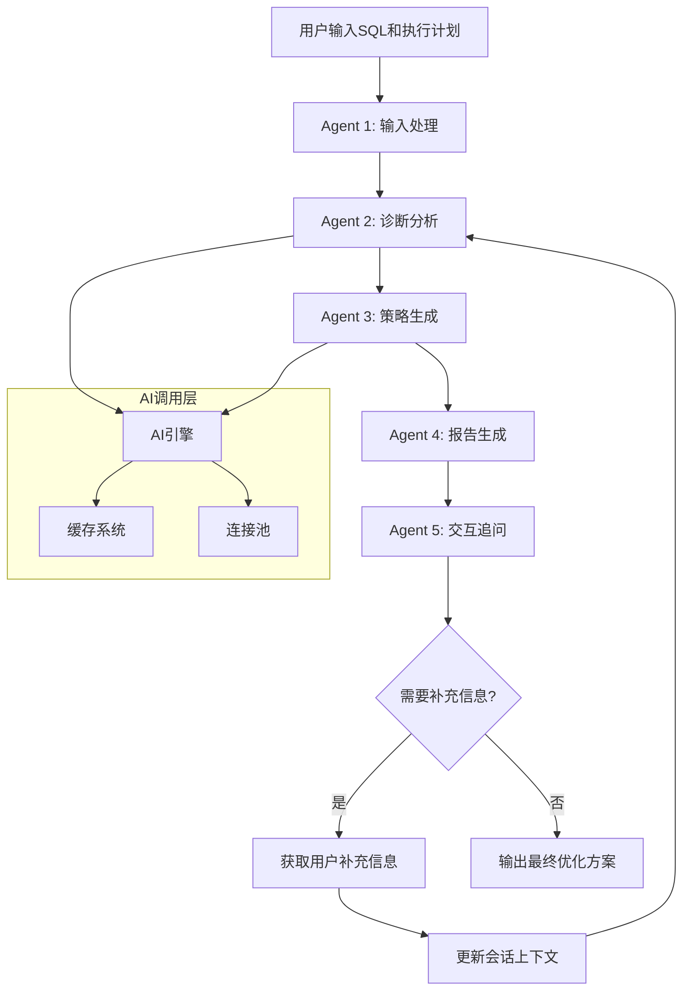
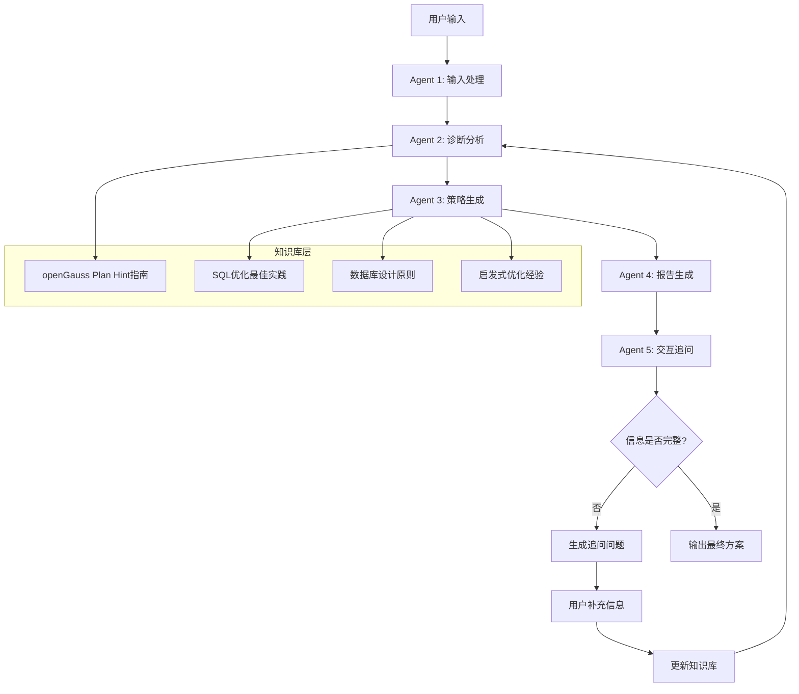

# Copilot SQL 优化助手 V4.0

## 📋 项目概述

Copilot SQL 优化助手是一个基于多Agent架构的智能SQL优化系统，专门为GaussDB/openGauss数据库设计。系统通过5个专业Agent协同工作，提供从SQL分析到优化建议的完整解决方案。

## 🏗️ 系统架构

### 核心组件
- **5个专业Agent**：输入处理、诊断分析、策略生成、报告生成、交互追问
- **AI引擎**：支持多种AI模型，具备缓存和连接池优化
- **会话管理**：循环迭代式优化，支持多轮对话
- **知识库**：结合官方文档和通用优化知识

### 技术栈
- **语言**：C++11
- **网络库**：libcurl
- **JSON处理**：nlohmann/json
- **AI接口**：OpenAI兼容API、Ollama本地模型

## 🤖 Agent架构详解

### Agent工作流程图



### Agent详细说明

#### Agent 1: 输入处理 (Input Processing)
**职责**：接收和验证用户输入
- 接收SQL语句和执行计划
- 验证输入格式和完整性
- 预处理和标准化输入数据
- 更新会话上下文

**输入**：
- SQL语句（多行支持）
- EXPLAIN ANALYZE执行计划

**输出**：
- 验证后的输入数据
- 标准化的会话上下文

#### Agent 2: 诊断分析 (Diagnostic Analysis)
**职责**：分析SQL性能问题
- 解析执行计划，识别性能瓶颈
- 分析SQL结构，发现潜在问题
- 生成诊断报告和症状列表
- 确定优化优先级

**分析维度**：
- 执行计划分析
- 索引使用情况
- 连接策略评估
- 资源消耗分析

**输出**：
```json
{
  "summary": "诊断摘要",
  "diagnostics": [
    {
      "symptom_id": "SYMPTOM_1",
      "symptom_description": "全表扫描导致性能问题",
      "potential_solution_paths": ["DOCUMENTED_HINT", "GENERAL_SQL_REFACTORING"]
    }
  ]
}
```

#### Agent 3: 策略生成 (Strategy Generation)
**职责**：生成多来源优化策略
- 基于诊断结果生成优化策略
- 结合官方文档和通用知识
- 生成具体的优化SQL
- 提供优化理由和预期效果

**策略来源**：
1. **官方文档策略**：基于openGauss Plan Hint
2. **通用SQL策略**：基于SQL优化最佳实践
3. **数据库设计策略**：索引、分区、统计信息优化
4. **启发式策略**：基于经验的优化建议

**输出**：
```json
{
  "summary": "策略生成摘要",
  "optimization_strategies": [
    {
      "strategy_id": "STRATEGY_1",
      "title": "使用索引扫描Hint",
      "recommendation": "建议使用indexscan hint",
      "source_tag": "[来源: 官方文档]",
      "optimized_sql": "SELECT /*+ indexscan(table idx) */ * FROM table",
      "reasoning": "优化理由说明"
    }
  ]
}
```

#### Agent 4: 报告生成 (Report Generation)
**职责**：生成分层标注报告
- 按来源分类整理优化建议
- 生成结构化的优化报告
- 提供优化后SQL汇总
- 评估预期优化效果

**报告结构**：
1. 基于官方文档的优化建议
2. 通用SQL优化建议
3. 数据库设计优化建议
4. 启发式优化建议
5. 优化后SQL汇总
6. 预期优化效果

#### Agent 5: 交互追问 (Interactive Q&A)
**职责**：智能追问和交互
- 分析报告中的信息缺口
- 识别假设性建议
- 生成针对性追问问题
- 处理用户响应并更新上下文

**追问类型**：
- 信息缺口补充
- 假设性建议确认
- 业务约束了解
- 性能要求明确

## 🎯 提示词系统详解

### 提示词提问逻辑架构



### 主提示词 (Master Prompt)

系统使用统一的主提示词确保AI理解任务要求：

```
你是GaussDB SQL优化专家。请根据用户输入的SQL和EXPLAIN(ANALYZE)结果，输出详细优化建议和优化后SQL。

要求：
1. 分析SQL性能问题
2. 提供多种来源的优化建议
3. 生成具体的优化SQL
4. 标注建议来源
5. 评估预期效果

知识库参考：
- openGauss Plan Hint调优完整指南
- SQL优化最佳实践
- 数据库设计原则
- 启发式优化经验
```

### Agent专用提示词

#### Agent 1  输入处理提示词
```
请接收并验证用户输入的SQL和执行计划信息：

输入内容：
SQL语句：{sql}
执行计划：{explain_plan}

请执行以下任务：
1. 验证SQL语法正确性
2. 检查执行计划格式完整性
3. 标准化输入数据格式
4. 更新会话上下文

输出要求：
- 验证结果（通过/失败）
- 标准化后的输入数据
- 会话上下文更新状态

如果输入不完整或格式错误，请明确指出需要补充的信息。
```

#### Agent 2 诊断分析提示词
```
请分析以下SQL和执行计划，识别性能问题并生成诊断报告：

SQL语句：{sql}
执行计划：{explain_plan}

请以JSON格式输出诊断结果，包含：
- 诊断摘要
- 性能症状列表
- 每个症状的解决路径

分析维度：
1. 执行计划分析：检查是否存在全表扫描、低效连接等
2. 索引使用情况：分析索引是否被正确使用
3. 连接策略评估：评估连接顺序和连接方式
4. 资源消耗分析：分析CPU、内存、IO使用情况

参考openGauss Plan Hint指南中的性能问题识别方法。

输出格式：
{
  "summary": "诊断摘要",
  "diagnostics": [
    {
      "symptom_id": "SYMPTOM_1",
      "symptom_description": "全表扫描导致性能问题",
      "potential_solution_paths": ["DOCUMENTED_HINT", "GENERAL_SQL_REFACTORING"]
    }
  ]
}
```

#### Agent 3 策略生成提示词
```
请根据以下诊断报告生成优化策略：

诊断摘要：{diagnostic_summary}
识别的问题：{symptoms}

请为每个问题生成多种来源的优化策略，包括：

1. 基于官方文档的策略（使用openGauss Plan Hint）：
   - leading hint：指定连接顺序
   - nestloop/hashjoin/mergejoin：指定连接方式
   - indexscan/tablescan：指定扫描方式
   - rows hint：指定结果集大小
   - blockname hint：指定子链接块名

2. 通用SQL优化策略：
   - 索引优化
   - 查询重写
   - 分区策略
   - 统计信息更新

3. 数据库设计策略：
   - 表结构优化
   - 索引设计
   - 分区设计
   - 统计信息管理

4. 启发式优化策略：
   - 基于经验的优化建议
   - 性能调优技巧
   - 最佳实践应用

请以JSON格式输出策略，确保每个策略都有明确的来源标签和具体的优化SQL。

输出格式：
{
  "summary": "策略生成摘要",
  "optimization_strategies": [
    {
      "strategy_id": "STRATEGY_1",
      "title": "使用索引扫描Hint",
      "recommendation": "建议使用indexscan hint",
      "source_tag": "[来源: 官方文档]",
      "optimized_sql": "SELECT /*+ indexscan(table idx) */ * FROM table",
      "reasoning": "优化理由说明"
    }
  ]
}
```

#### Agent 4 报告生成提示词

```
请根据以下优化策略生成分层标注报告：

优化策略：{strategies}

请生成结构化的优化报告，包含以下部分：

1. 基于官方文档的优化建议
   - 使用openGauss Plan Hint的具体建议
   - 包含完整的语法和示例
   - 标注来源为官方文档

2. 通用SQL优化建议
   - 基于SQL优化最佳实践
   - 包含通用的优化技巧
   - 适用于多种数据库

3. 数据库设计优化建议
   - 基于数据库设计原则
   - 包含表结构和索引优化
   - 长期性能优化建议

4. 启发式优化建议
   - 基于经验的优化建议
   - 包含性能调优技巧
   - 针对特定场景的优化

5. 优化后SQL汇总
   - 提供完整的优化后SQL
   - 包含所有建议的Hint
   - 标注每个优化的来源

6. 预期优化效果
   - 评估每个优化的预期效果
   - 提供性能改进的量化指标
   - 说明实施的风险和注意事项

请确保每个建议都明确标注来源，格式如：[来源: 官方文档]
```

#### Agent 5 交互追问提示词
```
请分析以下优化报告，识别信息缺口和假设性建议：

优化报告：{report}

请生成追问问题，帮助用户补充：

1. 缺失的具体信息：
   - 表结构信息（CREATE TABLE语句）
   - 索引信息（SHOW INDEXES）
   - 数据量级信息
   - 查询频率信息

2. 业务约束条件：
   - 是否允许创建索引
   - 是否允许修改表结构
   - 是否有性能要求
   - 是否有存储限制

3. 性能要求：
   - 响应时间要求
   - 并发量要求
   - 资源使用限制
   - 可用性要求

4. 假设性建议的确认：
   - 建议的适用性
   - 实施的风险
   - 预期的效果
   - 替代方案

请以结构化的方式生成追问问题，每个问题包含：
- 问题描述
- 原因说明
- 期望格式
- 重要性级别

输出格式：
{
  "questions": [
    {
      "question_id": "Q_TABLE_INFO",
      "question_text": "请提供具体的表名和索引名称",
      "reasoning": "需要具体的表名和索引信息来生成准确的Hint",
      "expected_value_type": "表名: xxx, 索引名: xxx",
      "importance": "HIGH"
    }
  ],
  "summary": "分析完成，生成了X个追问问题",
  "should_continue_conversation": true
}
```

### 提示词提问逻辑详解

#### 1. 信息收集阶段
```
系统会主动询问以下信息：

1. 基础信息：
   - SQL语句的完整内容
   - EXPLAIN ANALYZE的执行计划
   - 相关的表结构信息

2. 性能信息：
   - 当前查询的执行时间
   - 数据量级信息
   - 查询频率信息

3. 约束信息：
   - 业务约束条件
   - 性能要求
   - 资源限制
```

#### 2. 问题识别阶段
```
系统会识别以下类型的问题：

1. 执行计划问题：
   - 全表扫描
   - 低效连接
   - 索引未使用
   - 统计信息不准确

2. SQL结构问题：
   - 子查询优化
   - 聚合操作优化
   - 排序优化
   - 分页优化

3. 数据库设计问题：
   - 索引缺失
   - 表结构不合理
   - 分区策略不当
   - 统计信息过期
```

#### 3. 策略生成阶段
```
系统会生成以下类型的优化策略：

1. 官方文档策略：
   - 基于openGauss Plan Hint的具体建议
   - 包含完整的语法和示例
   - 标注来源为官方文档

2. 通用优化策略：
   - 基于SQL优化最佳实践
   - 包含通用的优化技巧
   - 适用于多种数据库

3. 设计优化策略：
   - 基于数据库设计原则
   - 包含表结构和索引优化
   - 长期性能优化建议

4. 启发式策略：
   - 基于经验的优化建议
   - 包含性能调优技巧
   - 针对特定场景的优化
```

#### 4. 交互追问阶段
```
系统会生成以下类型的追问：

1. 信息缺口追问：
   - 缺失的具体信息
   - 需要补充的数据
   - 需要确认的假设

2. 约束确认追问：
   - 业务约束条件
   - 性能要求
   - 资源限制

3. 建议确认追问：
   - 建议的适用性
   - 实施的风险
   - 预期的效果

4. 替代方案追问：
   - 其他可能的优化方案
   - 不同策略的对比
   - 最佳选择的建议
```

### 基于openGauss Plan Hint的知识库

系统集成了完整的openGauss Plan Hint调优指南，包括：

#### 1. Leading Hint（连接顺序）
```
语法格式：
- leading(join_table_list)：仅指定连接顺序
- leading((join_table_list))：同时指定连接顺序和内外表顺序

使用场景：
1. 当优化器选择的连接顺序不是最优时
2. 当需要控制内外表顺序时
3. 当需要优化多表连接的性能时

示例：
SELECT /*+ leading(t1 t2 t3) */ * FROM t1, t2, t3 WHERE ...
SELECT /*+ leading((t1 t2 t3)) */ * FROM t1, t2, t3 WHERE ...
```

#### 2. Join方式Hint（连接方法）
```
语法格式：
- [no] nestloop|hashjoin|mergejoin(table_list)

使用场景：
1. nestloop：适用于小表连接或索引条件
2. hashjoin：适用于大表连接且无索引
3. mergejoin：适用于已排序的数据

示例：
SELECT /*+ nestloop(t1 t2) */ * FROM t1, t2 WHERE ...
SELECT /*+ no hashjoin(t1 t2) */ * FROM t1, t2 WHERE ...
```

#### 3. Scan方式Hint（扫描方法）
```
语法格式：
- [no] tablescan|indexscan|indexonlyscan(table [index])

使用场景：
1. tablescan：强制使用全表扫描
2. indexscan：强制使用索引扫描
3. indexonlyscan：强制使用仅索引扫描

示例：
SELECT /*+ indexscan(t1 idx_t1_a) */ * FROM t1 WHERE a = 1;
SELECT /*+ no tablescan(t1) */ * FROM t1 WHERE a = 1;
```

#### 4. Rows Hint（结果集大小）
```
语法格式：
- rows(table_list #|+|-|* const)

使用场景：
1. 当统计信息不准确时
2. 当需要修正优化器的估算时
3. 当需要优化特定查询的性能时

示例：
SELECT /*+ rows(t1 #1000) */ * FROM t1 WHERE ...
SELECT /*+ rows(t1 t2 *2) */ * FROM t1, t2 WHERE ...
```

### 提示词优化策略

#### 1. 上下文管理
```
系统会维护完整的对话上下文：

1. 历史对话记录
2. 已确认的信息
3. 已排除的选项
4. 用户偏好设置

这样可以避免重复提问，提高交互效率。
```

#### 2. 优先级排序
```
系统会根据以下优先级生成问题：

1. 高优先级：影响优化效果的关键信息
2. 中优先级：有助于生成更好建议的信息
3. 低优先级：锦上添花的信息

这样可以确保最重要的信息优先被收集。
```

#### 3. 个性化适配
```
系统会根据用户的特点调整提问方式：

1. 技术专家：提供详细的技术细节
2. 业务用户：重点说明业务影响
3. 初学者：提供更多解释和示例
4. 经验用户：直接提供核心建议
```

### 知识库集成

系统集成了完整的openGauss Plan Hint调优指南，包括：

1. **14种主要Hint类型**：
   - Leading Hint（连接顺序）
   - Join方式Hint（连接方法）
   - Rows Hint（结果集大小）
   - Scan方式Hint（扫描方法）
   - 子链接块名Hint
   - 优化器GUC参数Hint
   - Custom Plan和Generic Plan选择Hint
   - 指定子查询不展开Hint
   - 指定不使用全局计划缓存Hint
   - 同层参数化路径Hint
   - 将部分Error降级为Warning的Hint
   - INDEX HINTS
   - 指定不使用全局计划缓存Hint
   - 同层参数化路径Hint

2. **完整的语法和示例**：
   - 每种Hint的语法格式
   - 参数说明和使用场景
   - 实际应用示例
   - 错误处理和告警信息

3. **最佳实践指导**：
   - 何时使用各种Hint
   - 如何避免常见错误
   - 性能优化的最佳实践
   - 故障排除指南

这个完整的提示词系统确保了Agent能够：
- ✅ 准确识别性能问题
- ✅ 生成基于官方文档的优化建议
- ✅ 提供个性化的交互体验
- ✅ 持续学习和改进优化策略

### 基于openGauss Plan Hint的知识库提示词

#### Leading Hint 提示词
```
基于openGauss Plan Hint指南，Leading Hint用于指定连接顺序：

语法格式：
- leading(join_table_list)：仅指定连接顺序
- leading((join_table_list))：同时指定连接顺序和内外表顺序

使用场景：
1. 当优化器选择的连接顺序不是最优时
2. 当需要控制内外表顺序时
3. 当需要优化多表连接的性能时

示例：
SELECT /*+ leading(t1 t2 t3) */ * FROM t1, t2, t3 WHERE ...
SELECT /*+ leading((t1 t2 t3)) */ * FROM t1, t2, t3 WHERE ...
```

#### Join方式Hint提示词
```
基于openGauss Plan Hint指南，Join方式Hint用于指定连接方法：

语法格式：
- [no] nestloop|hashjoin|mergejoin(table_list)

使用场景：
1. nestloop：适用于小表连接或索引条件
2. hashjoin：适用于大表连接且无索引
3. mergejoin：适用于已排序的数据

示例：
SELECT /*+ nestloop(t1 t2) */ * FROM t1, t2 WHERE ...
SELECT /*+ no hashjoin(t1 t2) */ * FROM t1, t2 WHERE ...
```

#### Scan方式Hint提示词
```
基于openGauss Plan Hint指南，Scan方式Hint用于指定扫描方法：

语法格式：
- [no] tablescan|indexscan|indexonlyscan(table [index])

使用场景：
1. tablescan：强制使用全表扫描
2. indexscan：强制使用索引扫描
3. indexonlyscan：强制使用仅索引扫描

示例：
SELECT /*+ indexscan(t1 idx_t1_a) */ * FROM t1 WHERE a = 1;
SELECT /*+ no tablescan(t1) */ * FROM t1 WHERE a = 1;
```

#### Rows Hint提示词
```
基于openGauss Plan Hint指南，Rows Hint用于指定结果集大小：

语法格式：
- rows(table_list #|+|-|* const)

使用场景：
1. 当统计信息不准确时
2. 当需要修正优化器的估算时
3. 当需要优化特定查询的性能时

示例：
SELECT /*+ rows(t1 #1000) */ * FROM t1 WHERE ...
SELECT /*+ rows(t1 t2 *2) */ * FROM t1, t2 WHERE ...
```

### 提示词提问逻辑详解

#### 1. 信息收集阶段
```
系统会主动询问以下信息：

1. 基础信息：
   - SQL语句的完整内容
   - EXPLAIN ANALYZE的执行计划
   - 相关的表结构信息

2. 性能信息：
   - 当前查询的执行时间
   - 数据量级信息
   - 查询频率信息

3. 约束信息：
   - 业务约束条件
   - 性能要求
   - 资源限制
```

#### 2. 问题识别阶段
```
系统会识别以下类型的问题：

1. 执行计划问题：
   - 全表扫描
   - 低效连接
   - 索引未使用
   - 统计信息不准确

2. SQL结构问题：
   - 子查询优化
   - 聚合操作优化
   - 排序优化
   - 分页优化

3. 数据库设计问题：
   - 索引缺失
   - 表结构不合理
   - 分区策略不当
   - 统计信息过期
```

#### 3. 策略生成阶段
```
系统会生成以下类型的优化策略：

1. 官方文档策略：
   - 基于openGauss Plan Hint的具体建议
   - 包含完整的语法和示例
   - 标注来源为官方文档

2. 通用优化策略：
   - 基于SQL优化最佳实践
   - 包含通用的优化技巧
   - 适用于多种数据库

3. 设计优化策略：
   - 基于数据库设计原则
   - 包含表结构和索引优化
   - 长期性能优化建议

4. 启发式策略：
   - 基于经验的优化建议
   - 包含性能调优技巧
   - 针对特定场景的优化
```

#### 4. 交互追问阶段
```
系统会生成以下类型的追问：

1. 信息缺口追问：
   - 缺失的具体信息
   - 需要补充的数据
   - 需要确认的假设

2. 约束确认追问：
   - 业务约束条件
   - 性能要求
   - 资源限制

3. 建议确认追问：
   - 建议的适用性
   - 实施的风险
   - 预期的效果

4. 替代方案追问：
   - 其他可能的优化方案
   - 不同策略的对比
   - 最佳选择的建议
```

### 提示词优化策略

#### 1. 上下文管理
```
系统会维护完整的对话上下文：

1. 历史对话记录
2. 已确认的信息
3. 已排除的选项
4. 用户偏好设置

这样可以避免重复提问，提高交互效率。
```

#### 2. 优先级排序
```
系统会根据以下优先级生成问题：

1. 高优先级：影响优化效果的关键信息
2. 中优先级：有助于生成更好建议的信息
3. 低优先级：锦上添花的信息

这样可以确保最重要的信息优先被收集。
```

#### 3. 个性化适配
```
系统会根据用户的特点调整提问方式：

1. 技术专家：提供详细的技术细节
2. 业务用户：重点说明业务影响
3. 初学者：提供更多解释和示例
4. 经验用户：直接提供核心建议
```

### 知识库集成

系统集成了完整的openGauss Plan Hint调优指南，包括：

1. **14种主要Hint类型**：
   - Leading Hint（连接顺序）
   - Join方式Hint（连接方法）
   - Rows Hint（结果集大小）
   - Scan方式Hint（扫描方法）
   - 子链接块名Hint
   - 优化器GUC参数Hint
   - Custom Plan和Generic Plan选择Hint
   - 指定子查询不展开Hint
   - 指定不使用全局计划缓存Hint
   - 同层参数化路径Hint
   - 将部分Error降级为Warning的Hint
   - INDEX HINTS
   - 指定不使用全局计划缓存Hint
   - 同层参数化路径Hint

2. **完整的语法和示例**：
   - 每种Hint的语法格式
   - 参数说明和使用场景
   - 实际应用示例
   - 错误处理和告警信息

3. **最佳实践指导**：
   - 何时使用各种Hint
   - 如何避免常见错误
   - 性能优化的最佳实践
   - 故障排除指南

这个完整的提示词系统确保了Agent能够：
- ✅ 准确识别性能问题
- ✅ 生成基于官方文档的优化建议
- ✅ 提供个性化的交互体验
- ✅ 持续学习和改进优化策略 